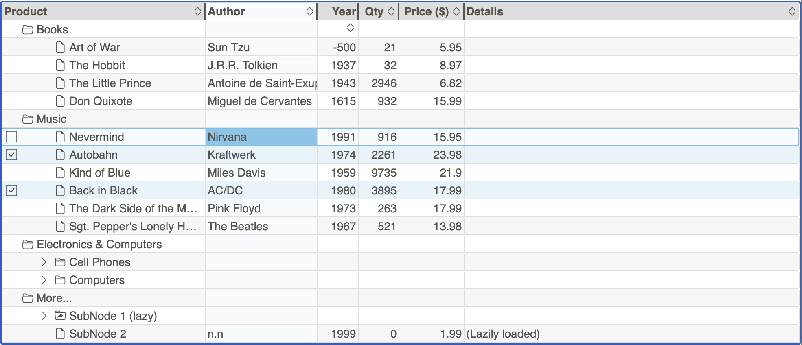

<!-- _coverpage.md -->

    Wunderbaum has still beta status: 
    API, Markup, Stylesheet, etc. are still subject to change.

# Wunderbaum <small>@VERSION</small>

> A modern JavaScript tree/treegrid control.

- Supports drag and drop, editing, filtering, and multi-selection.
- Written in TypeScript, transpiled to ES6 (esm & umd).
- Performant handling of _big_ data structures.
- Provide an object oriented API.
- Framework agnostic.
- Zero dependencies.
- Keyboard support.

[Documentation](/welcome.md)
[Online Demo](https://mar10.github.io/wunderbaum/demo/)
[GitHub](https://github.com/mar10/wunderbaum/)
