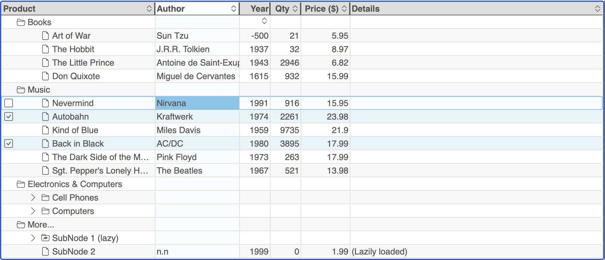

# User Guide

> A modern JavaScript tree/treegrid control.

!!! info

    Wunderbaum has beta status:
    API, Markup, Stylesheet, etc. are still subject to change.

- [Quick Start](tutorial/quick_start.md)
- [API Reference](https://mar10.github.io/wunderbaum/api/index.html){:target="\_blank"}
- [Online Demo](https://mar10.github.io/wunderbaum/demo/){:target="\_blank"}
- [Source Code on GitHub](https://github.com/mar10/wunderbaum){:target="\_blank"}

- Supports drag and drop, editing, filtering, sorting, and multi-selection.
- Written in TypeScript, transpiled to ES6 (esm & umd).
- Performant handling of _big_ data structures.
- Provide an object oriented API.
- Framework agnostic.
- Zero dependencies.
- Keyboard support.
